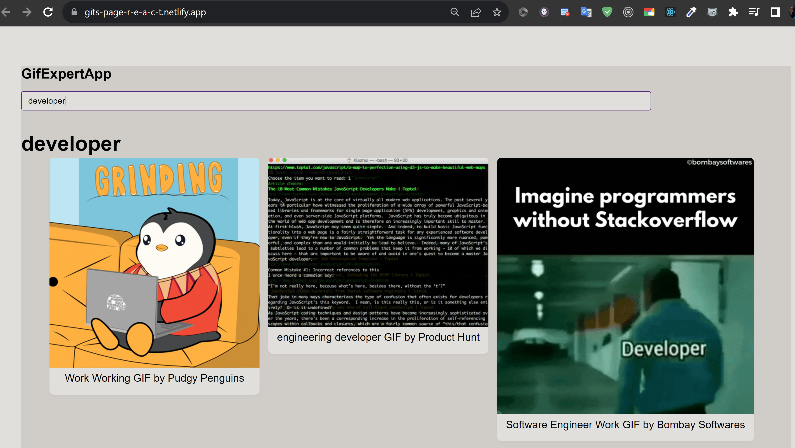

# Git Expert App React

Esta es una aplicación web desarrollada en React para buscar y mostrar imágenes GIF utilizando la API de [Giphy](https://developers.giphy.com/).

## Características

- Buscar y mostrar imágenes GIF según diferentes categorías.
- Uso de componentes funcionales de React y hooks personalizados.
- Integración con la API de Giphy para obtener imágenes GIF.
- Diseño responsive y atractivo.

#[URL](https://gits-page-r-e-a-c-t.netlify.app/)
https://gits-page-r-e-a-c-t.netlify.app/

## Requisitos Previos

Asegúrate de tener instalado Node.js en tu máquina. Puedes descargarlo desde [nodejs.org](https://nodejs.org/).

## Instalación

1. Clona este repositorio en tu máquina local:

   git clone https://github.com/elto82/git-expert-app-react.git
Navega al directorio del proyecto:

cd git-expert-app-react
Instala las dependencias:

npm install

-Uso
Ejecuta la aplicación en modo de desarrollo:

npm run dev
Esto iniciará el servidor de desarrollo de Vite y podrás acceder a la aplicación en tu entorno local

Para construir la aplicación para producción:

npm run build
Esto generará los archivos optimizados en la carpeta dist.

Contribución
Si quieres contribuir a este proyecto, ¡eres bienvenido! Puedes abrir un issue para discutir tus ideas o enviar un pull request directamente.

Licencia
Este proyecto está bajo la Licencia MIT. Consulta el archivo LICENSE para más detalles.

