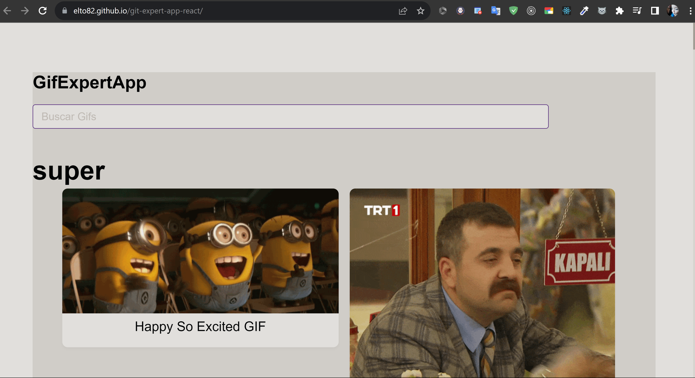

# Git Expert App React

Esta es una aplicación web desarrollada en React para buscar y mostrar imágenes GIF utilizando la API de [Giphy](https://developers.giphy.com/).

## Características

- Buscar y mostrar imágenes GIF según diferentes categorías.
- Uso de componentes funcionales de React y hooks personalizados.
- Integración con la API de Giphy para obtener imágenes GIF.
- Diseño responsive y atractivo.
  
#

# [URL](https://gits-page-r-e-a-c-t.netlify.app/)

https://gits-page-r-e-a-c-t.netlify.app/

[GitHubPage](https://elto82.github.io/git-expert-app-react/)

## Requisitos Previos

Asegúrate de tener instalado Node.js en tu máquina. Puedes descargarlo desde [nodejs.org](https://nodejs.org/).

## Instalación

1. Clona este repositorio en tu máquina local:

   git clone https://github.com/elto82/git-expert-app-react.git
Navega al directorio del proyecto:

cd git-expert-app-react
Instala las dependencias:

npm install

-Uso
Ejecuta la aplicación en modo de desarrollo:

npm run dev
Esto iniciará el servidor de desarrollo de Vite y podrás acceder a la aplicación en tu entorno local

Para construir la aplicación para producción:

npm run build
Esto generará los archivos optimizados en la carpeta dist.

Contribución
Si quieres contribuir a este proyecto, ¡eres bienvenido! Puedes abrir un issue para discutir tus ideas o enviar un pull request directamente.

Licencia
Este proyecto está bajo la Licencia MIT. Consulta el archivo LICENSE para más detalles.

# Instalación y configuracion de Jest + React Testing Library En proyectos de React + Vite

## Instalaciones:

- npm install --dev jest babel-jest @babel/preset-env @babel/preset-react 
- npm install --dev @testing-library/react @types/jest jest-environment-jsdom
  
### Opcional: Si usamos Fetch API en el proyecto:

npm install --dev whatwg-fetch

- Actualizar los scripts del package.json  
 - "scripts": {
  ...
  "test": "jest --watchAll"

### Crear la configuración de babel babel.config.cjs

module.exports = {
  presets: [
    ["@babel/preset-env", { targets: { esmodules: true } }],
    ["@babel/preset-react", { runtime: "automatic" }],
  ],
};

### Opcional, pero eventualmente necesario, crear Jest config y setup :

jest.config.js

module.exports = {
  testEnvironment: "jsdom", // Usar el entorno de prueba jsdom
  setupFiles: ["./jest.setup.js"],
};

jest.setup.js

En caso de necesitar la implementación del FetchAPI

- import "whatwg-fetch"; // Importar here "whatwg-fetch" para el entorno de prueba
